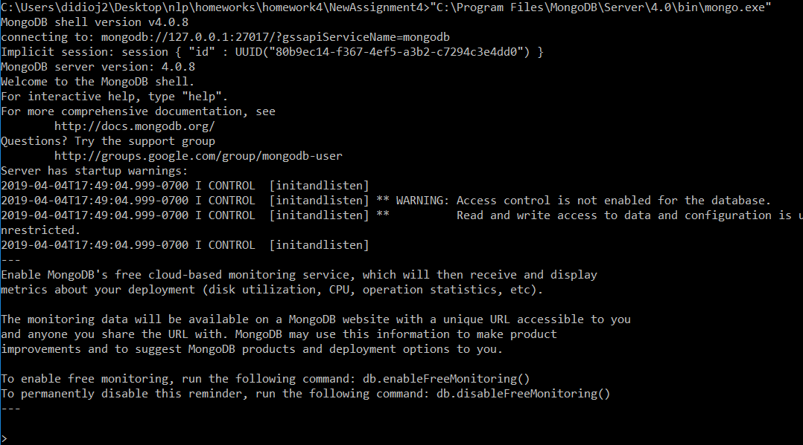
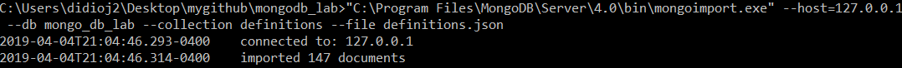
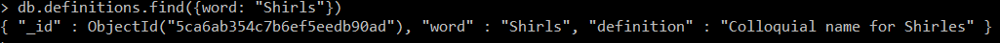
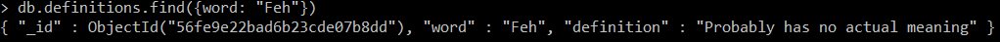
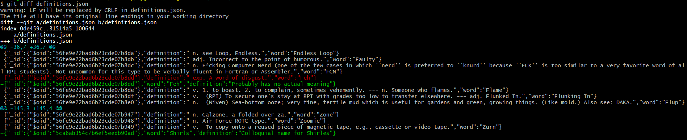
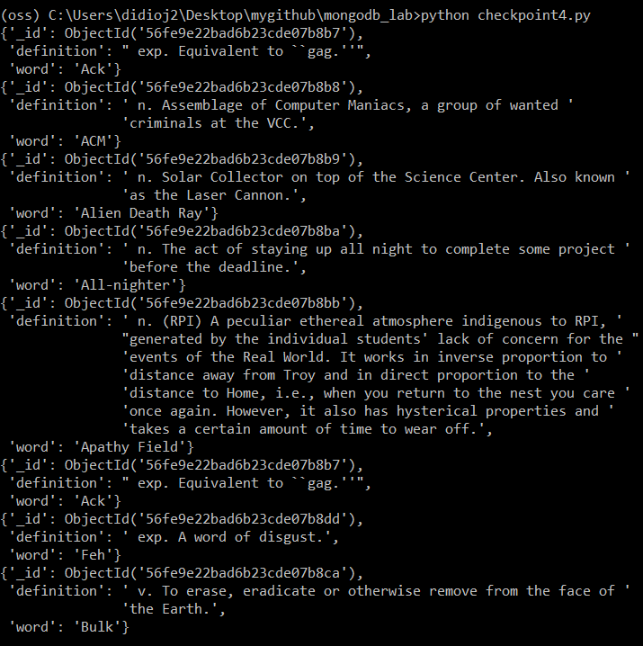
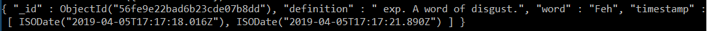

# Lab 10:

## Checkpoint 1:



## Checkpoint 2:



## Checkpoint 3:

### Record that I entered:


### Record that I updated:


### Git diff:


## Checkpoint 4:

### Script:
```python
from pymongo import MongoClient
import pprint
from bson.objectid import ObjectId

client = MongoClient()

if __name__ == '__main__':
    db = client.mongo_db_lab.definitions
    i = 0
    for definition in db.find():
        if i == 5:
            break
        pprint.pprint(definition)
        i += 1
    pprint.pprint(db.find_one())
    for definition in db.find({"word": "Feh"}):
        pprint.pprint(definition)
    for definition in db.find({"_id": ObjectId("56fe9e22bad6b23cde07b8ca")}):
        pprint.pprint(definition)
    db.insert_one({"word": "ChemE", "definition": "Synonymous with Hell."})

```
### Pprint output:



## Checkpoint 5:

### Script:
```python

from pymongo import MongoClient
import pprint
from bson.objectid import ObjectId
import datetime
import random
client = MongoClient()


def random_word_requester():
    db = client.mongo_db_lab.definitions
    for definition in db.aggregate( [ { "$sample": { "size": 1 } } ] ):
        ids = definition["_id"]
        db.update({"_id": ids}, {"$push": {"timestamp": datetime.datetime.utcnow()}})
        for definition in db.find({"_id": ids}):
            pprint.pprint(definition)
    '''
    This function should return a random word and its definition and also
    log in the MongoDB database the timestamp that it was accessed.
    '''
    return 0


if __name__ == '__main__':
    random_word_requester()

```

### Find result:
