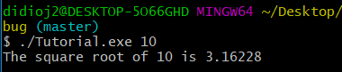
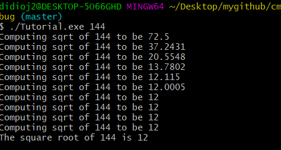

# Lab 5:

## Part 1:

### Results from Step 1:

### Results from Step 2:

### Results from Step 3:

### Results from Step 4:

### Results from Step 5:

## Part 2:

### Makefile:

~~~
 block.o:  
    cc block.c -c -o block.o -fPIC  
    cc -shared block.o -o block.so  
    ar qc block.a block.o  
    cc ../program.c block.a -o static_block.out  
    cc ../program.c block.so -o dynamic_block.out -Wl,-rpath .

 clean:  
    rm \*.o  
    rm \*.a  
    rm \*.so  
    rm \*.out  
~~~

### CMakeFile:

~~~
cmake_minimum_required(VERSION 3.0)  

project(Blocks)  

add_library(staticblocks STATIC block.c)  

add_library(dynamicblocks SHARED block.c)  

add_executable(program1 ../program.c)  

add_executable(program2 ../program.c)  

target_link_libraries(program1 dynamicblocks)  

target_link_libraries(program2 staticblocks)  
~~~

### Makefile from CMake:

~~~

# CMAKE generated file: DO NOT EDIT!
# Generated by "Unix Makefiles" Generator, CMake Version 3.5

# Default target executed when no arguments are given to make.
default_target: all

.PHONY : default_target

# Allow only one "make -f Makefile2" at a time, but pass parallelism.
.NOTPARALLEL:

#=============================================================================
# Special targets provided by cmake.

# Disable implicit rules so canonical targets will work.
.SUFFIXES:

# Remove some rules from gmake that .SUFFIXES does not remove.
SUFFIXES =

.SUFFIXES: .hpux_make_needs_suffix_list

# Suppress display of executed commands.
$(VERBOSE).SILENT:

# A target that is always out of date.
cmake_force:

.PHONY : cmake_force

#=============================================================================
# Set environment variables for the build.

# The shell in which to execute make rules.
SHELL = /bin/sh

# The CMake executable.
CMAKE_COMMAND = /usr/bin/cmake

# The command to remove a file.
RM = /usr/bin/cmake -E remove -f

# Escaping for special characters.
EQUALS = =

# The top-level source directory on which CMake was run.
CMAKE_SOURCE_DIR = /mnt/c/Users/didioj2/Desktop/mygithub/CSCI-49XX-OpenSource/Modules/BuildSystems/Lab-Example/source

# The top-level build directory on which CMake was run.
CMAKE_BINARY_DIR = /mnt/c/Users/didioj2/Desktop/mygithub/CSCI-49XX-OpenSource/Modules/BuildSystems/Lab-Example/build

#=============================================================================
# Targets provided globally by CMake.

# Special rule for the target edit_cache
edit_cache:
	@$(CMAKE_COMMAND) -E cmake_echo_color --switch=$(COLOR) --cyan "No interactive CMake dialog available..."
	/usr/bin/cmake -E echo No\ interactive\ CMake\ dialog\ available.
.PHONY : edit_cache

# Special rule for the target edit_cache
edit_cache/fast: edit_cache

.PHONY : edit_cache/fast

# Special rule for the target rebuild_cache
rebuild_cache:
	@$(CMAKE_COMMAND) -E cmake_echo_color --switch=$(COLOR) --cyan "Running CMake to regenerate build system..."
	/usr/bin/cmake -H$(CMAKE_SOURCE_DIR) -B$(CMAKE_BINARY_DIR)
.PHONY : rebuild_cache

# Special rule for the target rebuild_cache
rebuild_cache/fast: rebuild_cache

.PHONY : rebuild_cache/fast

# The main all target
all: cmake_check_build_system
	$(CMAKE_COMMAND) -E cmake_progress_start /mnt/c/Users/didioj2/Desktop/mygithub/CSCI-49XX-OpenSource/Modules/BuildSystems/Lab-Example/build/CMakeFiles /mnt/c/Users/didioj2/Desktop/mygithub/CSCI-49XX-OpenSource/Modules/BuildSystems/Lab-Example/build/CMakeFiles/progress.marks
	$(MAKE) -f CMakeFiles/Makefile2 all
	$(CMAKE_COMMAND) -E cmake_progress_start /mnt/c/Users/didioj2/Desktop/mygithub/CSCI-49XX-OpenSource/Modules/BuildSystems/Lab-Example/build/CMakeFiles 0
.PHONY : all

# The main clean target
clean:
	$(MAKE) -f CMakeFiles/Makefile2 clean
.PHONY : clean

# The main clean target
clean/fast: clean

.PHONY : clean/fast

# Prepare targets for installation.
preinstall: all
	$(MAKE) -f CMakeFiles/Makefile2 preinstall
.PHONY : preinstall

# Prepare targets for installation.
preinstall/fast:
	$(MAKE) -f CMakeFiles/Makefile2 preinstall
.PHONY : preinstall/fast

# clear depends
depend:
	$(CMAKE_COMMAND) -H$(CMAKE_SOURCE_DIR) -B$(CMAKE_BINARY_DIR) --check-build-system CMakeFiles/Makefile.cmake 1
.PHONY : depend

#=============================================================================
# Target rules for targets named dynamicblocks

# Build rule for target.
dynamicblocks: cmake_check_build_system
	$(MAKE) -f CMakeFiles/Makefile2 dynamicblocks
.PHONY : dynamicblocks

# fast build rule for target.
dynamicblocks/fast:
	$(MAKE) -f CMakeFiles/dynamicblocks.dir/build.make CMakeFiles/dynamicblocks.dir/build
.PHONY : dynamicblocks/fast

#=============================================================================
# Target rules for targets named staticblocks

# Build rule for target.
staticblocks: cmake_check_build_system
	$(MAKE) -f CMakeFiles/Makefile2 staticblocks
.PHONY : staticblocks

# fast build rule for target.
staticblocks/fast:
	$(MAKE) -f CMakeFiles/staticblocks.dir/build.make CMakeFiles/staticblocks.dir/build
.PHONY : staticblocks/fast

#=============================================================================
# Target rules for targets named program1

# Build rule for target.
program1: cmake_check_build_system
	$(MAKE) -f CMakeFiles/Makefile2 program1
.PHONY : program1

# fast build rule for target.
program1/fast:
	$(MAKE) -f CMakeFiles/program1.dir/build.make CMakeFiles/program1.dir/build
.PHONY : program1/fast

#=============================================================================
# Target rules for targets named program2

# Build rule for target.
program2: cmake_check_build_system
	$(MAKE) -f CMakeFiles/Makefile2 program2
.PHONY : program2

# fast build rule for target.
program2/fast:
	$(MAKE) -f CMakeFiles/program2.dir/build.make CMakeFiles/program2.dir/build
.PHONY : program2/fast

block.o: block.c.o

.PHONY : block.o

# target to build an object file
block.c.o:
	$(MAKE) -f CMakeFiles/dynamicblocks.dir/build.make CMakeFiles/dynamicblocks.dir/block.c.o
	$(MAKE) -f CMakeFiles/staticblocks.dir/build.make CMakeFiles/staticblocks.dir/block.c.o
.PHONY : block.c.o

block.i: block.c.i

.PHONY : block.i

# target to preprocess a source file
block.c.i:
	$(MAKE) -f CMakeFiles/dynamicblocks.dir/build.make CMakeFiles/dynamicblocks.dir/block.c.i
	$(MAKE) -f CMakeFiles/staticblocks.dir/build.make CMakeFiles/staticblocks.dir/block.c.i
.PHONY : block.c.i

block.s: block.c.s

.PHONY : block.s

# target to generate assembly for a file
block.c.s:
	$(MAKE) -f CMakeFiles/dynamicblocks.dir/build.make CMakeFiles/dynamicblocks.dir/block.c.s
	$(MAKE) -f CMakeFiles/staticblocks.dir/build.make CMakeFiles/staticblocks.dir/block.c.s
.PHONY : block.c.s

mnt/c/Users/didioj2/Desktop/mygithub/CSCI-49XX-OpenSource/Modules/BuildSystems/Lab-Example/program.o: mnt/c/Users/didioj2/Desktop/mygithub/CSCI-49XX-OpenSource/Modules/BuildSystems/Lab-Example/program.c.o

.PHONY : mnt/c/Users/didioj2/Desktop/mygithub/CSCI-49XX-OpenSource/Modules/BuildSystems/Lab-Example/program.o

# target to build an object file
mnt/c/Users/didioj2/Desktop/mygithub/CSCI-49XX-OpenSource/Modules/BuildSystems/Lab-Example/program.c.o:
	$(MAKE) -f CMakeFiles/program1.dir/build.make CMakeFiles/program1.dir/mnt/c/Users/didioj2/Desktop/mygithub/CSCI-49XX-OpenSource/Modules/BuildSystems/Lab-Example/program.c.o
	$(MAKE) -f CMakeFiles/program2.dir/build.make CMakeFiles/program2.dir/mnt/c/Users/didioj2/Desktop/mygithub/CSCI-49XX-OpenSource/Modules/BuildSystems/Lab-Example/program.c.o
.PHONY : mnt/c/Users/didioj2/Desktop/mygithub/CSCI-49XX-OpenSource/Modules/BuildSystems/Lab-Example/program.c.o

mnt/c/Users/didioj2/Desktop/mygithub/CSCI-49XX-OpenSource/Modules/BuildSystems/Lab-Example/program.i: mnt/c/Users/didioj2/Desktop/mygithub/CSCI-49XX-OpenSource/Modules/BuildSystems/Lab-Example/program.c.i

.PHONY : mnt/c/Users/didioj2/Desktop/mygithub/CSCI-49XX-OpenSource/Modules/BuildSystems/Lab-Example/program.i

# target to preprocess a source file
mnt/c/Users/didioj2/Desktop/mygithub/CSCI-49XX-OpenSource/Modules/BuildSystems/Lab-Example/program.c.i:
	$(MAKE) -f CMakeFiles/program1.dir/build.make CMakeFiles/program1.dir/mnt/c/Users/didioj2/Desktop/mygithub/CSCI-49XX-OpenSource/Modules/BuildSystems/Lab-Example/program.c.i
	$(MAKE) -f CMakeFiles/program2.dir/build.make CMakeFiles/program2.dir/mnt/c/Users/didioj2/Desktop/mygithub/CSCI-49XX-OpenSource/Modules/BuildSystems/Lab-Example/program.c.i
.PHONY : mnt/c/Users/didioj2/Desktop/mygithub/CSCI-49XX-OpenSource/Modules/BuildSystems/Lab-Example/program.c.i

mnt/c/Users/didioj2/Desktop/mygithub/CSCI-49XX-OpenSource/Modules/BuildSystems/Lab-Example/program.s: mnt/c/Users/didioj2/Desktop/mygithub/CSCI-49XX-OpenSource/Modules/BuildSystems/Lab-Example/program.c.s

.PHONY : mnt/c/Users/didioj2/Desktop/mygithub/CSCI-49XX-OpenSource/Modules/BuildSystems/Lab-Example/program.s

# target to generate assembly for a file
mnt/c/Users/didioj2/Desktop/mygithub/CSCI-49XX-OpenSource/Modules/BuildSystems/Lab-Example/program.c.s:
	$(MAKE) -f CMakeFiles/program1.dir/build.make CMakeFiles/program1.dir/mnt/c/Users/didioj2/Desktop/mygithub/CSCI-49XX-OpenSource/Modules/BuildSystems/Lab-Example/program.c.s
	$(MAKE) -f CMakeFiles/program2.dir/build.make CMakeFiles/program2.dir/mnt/c/Users/didioj2/Desktop/mygithub/CSCI-49XX-OpenSource/Modules/BuildSystems/Lab-Example/program.c.s
.PHONY : mnt/c/Users/didioj2/Desktop/mygithub/CSCI-49XX-OpenSource/Modules/BuildSystems/Lab-Example/program.c.s

# Help Target
help:
	@echo "The following are some of the valid targets for this Makefile:"
	@echo "... all (the default if no target is provided)"
	@echo "... clean"
	@echo "... depend"
	@echo "... edit_cache"
	@echo "... rebuild_cache"
	@echo "... dynamicblocks"
	@echo "... staticblocks"
	@echo "... program1"
	@echo "... program2"
	@echo "... block.o"
	@echo "... block.i"
	@echo "... block.s"
	@echo "... mnt/c/Users/didioj2/Desktop/mygithub/CSCI-49XX-OpenSource/Modules/BuildSystems/Lab-Example/program.o"
	@echo "... mnt/c/Users/didioj2/Desktop/mygithub/CSCI-49XX-OpenSource/Modules/BuildSystems/Lab-Example/program.i"
	@echo "... mnt/c/Users/didioj2/Desktop/mygithub/CSCI-49XX-OpenSource/Modules/BuildSystems/Lab-Example/program.s"
.PHONY : help

#=============================================================================
# Special targets to cleanup operation of make.

# Special rule to run CMake to check the build system integrity.
# No rule that depends on this can have commands that come from listfiles
# because they might be regenerated.
cmake_check_build_system:
	$(CMAKE_COMMAND) -H$(CMAKE_SOURCE_DIR) -B$(CMAKE_BINARY_DIR) --check-build-system CMakeFiles/Makefile.cmake 0
.PHONY : cmake_check_build_system

~~~

### File sizes:

program1 shared library: 8600 KB
program2 shared library: 8784 KB

### Program Results:

#### Program 1:

#### Program 2:
