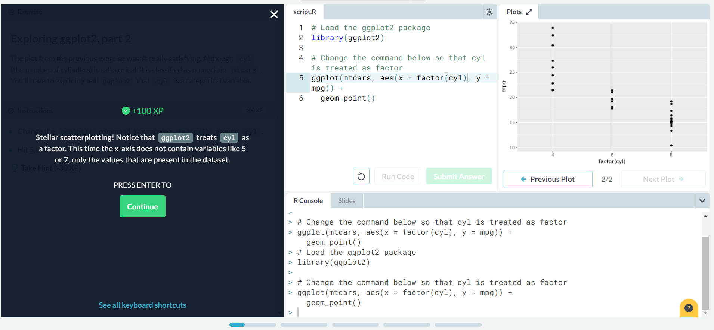

# Lab 7:

### Data Visualization with ggplot2 (Part 1) Screenshots:

### Multiple and Logistic Regression introduction Screenshots:

### Link to project observatory:

[link](https://rcos.io/projects/stupdown/stupdown-atom-md/profile)