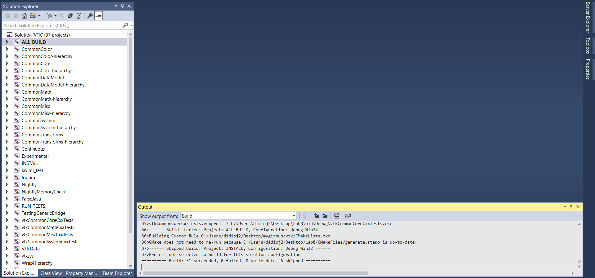
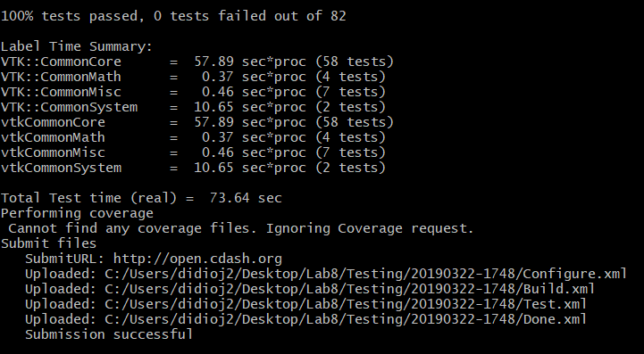
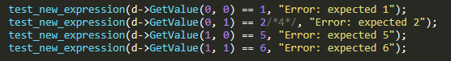

# Lab 8:

## Checkpoint 1:

## Checkpoint 2:

## Checkpoint 3:

## Checkpoint 4:

## Fix for array interpolation density:

## Observations:

On the dashboard, I am able to see the details of which tests were run by clicking on the
number below the appropriate category. And failed tests let you see the error condition for
debugging. This helped me determine that the problem with the test that we added that failed
was a simple problem with one of the comparison tests. In all, the dashboard for VTK provides
a lot of useful information regarding which tests run successfully on which architectures, and
provides useful debugging information if tests fail.