# Lab 9:

## Screenshots and steps taken:

### Example 00:

First, I installed Docker using their Desktop client with Hyper-V.

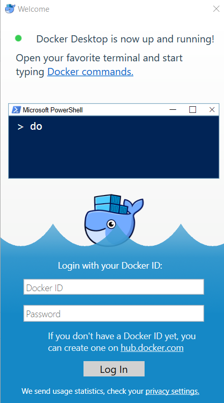
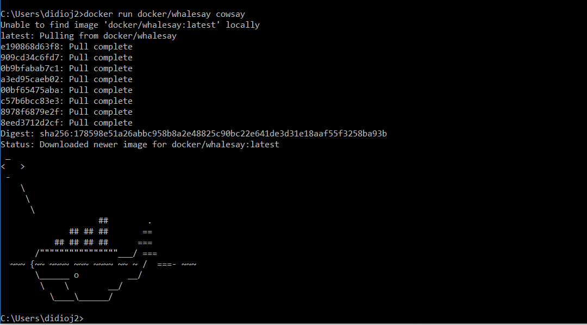

### Example 01:

I then used Docker to open up an interactive bash terminal.

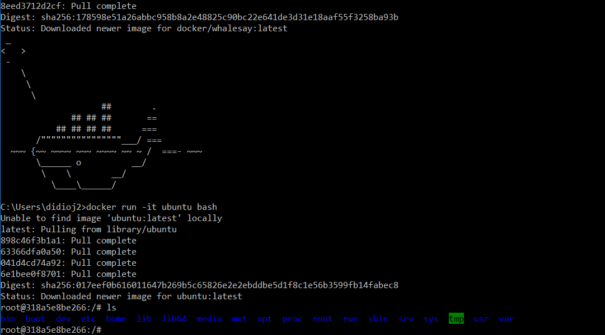

Then I installed Vim in the Ubuntu container, and used it. After that, I installed cowsay and ran it.

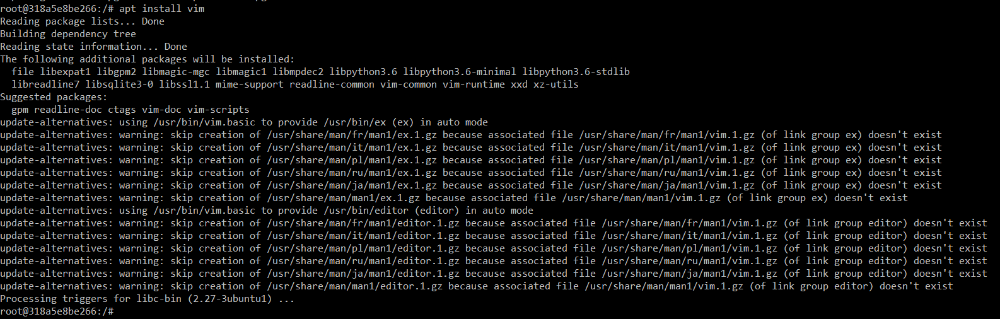
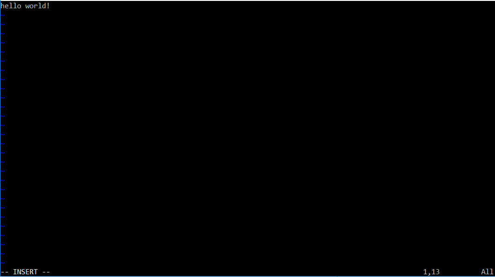
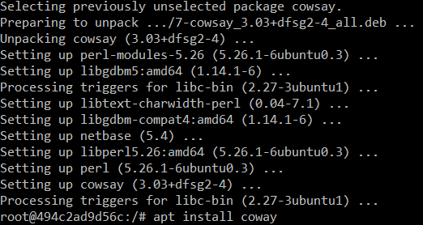
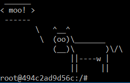

### Example 02:

I then installed and started an instance of mongoDB.

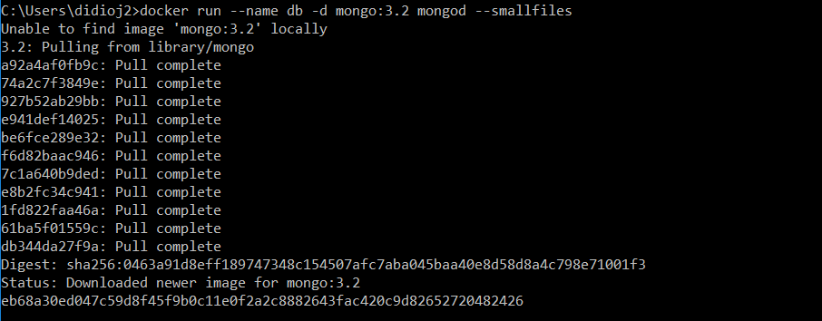

Then, I installed rocketchat, and used my web browser to ensure that it was running correctly.

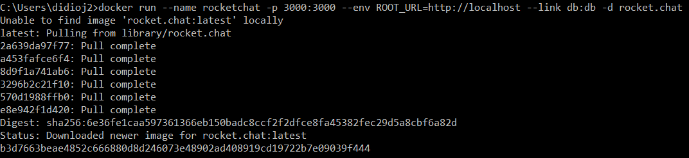
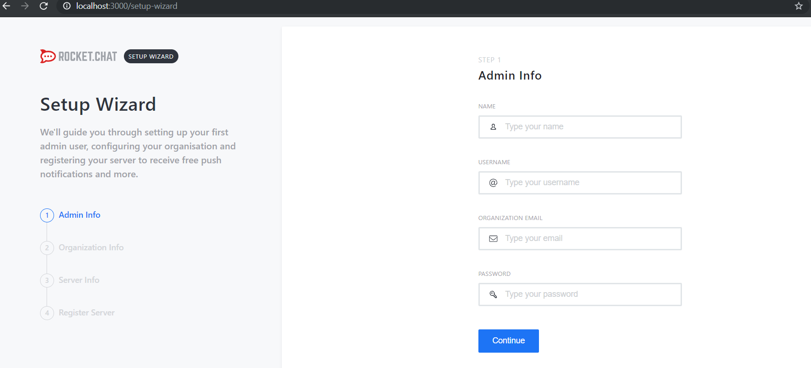

### Example 03:

Next, I created a Dockerfile to install a Python distribution, and I built it and ran it, inspecting the output in a web browser to make sure it was functioning correctly.

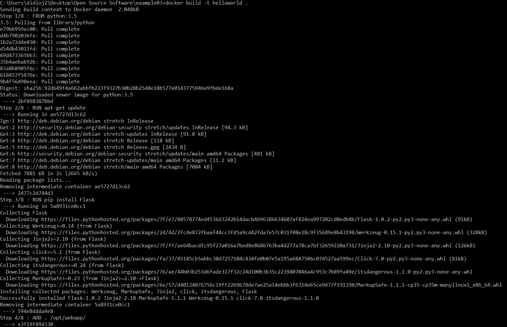
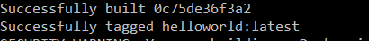

### Example 04:

I then set up a Node.js container with a dockerfile and built it. I also ran it to confirm that it would fail to connect at first.

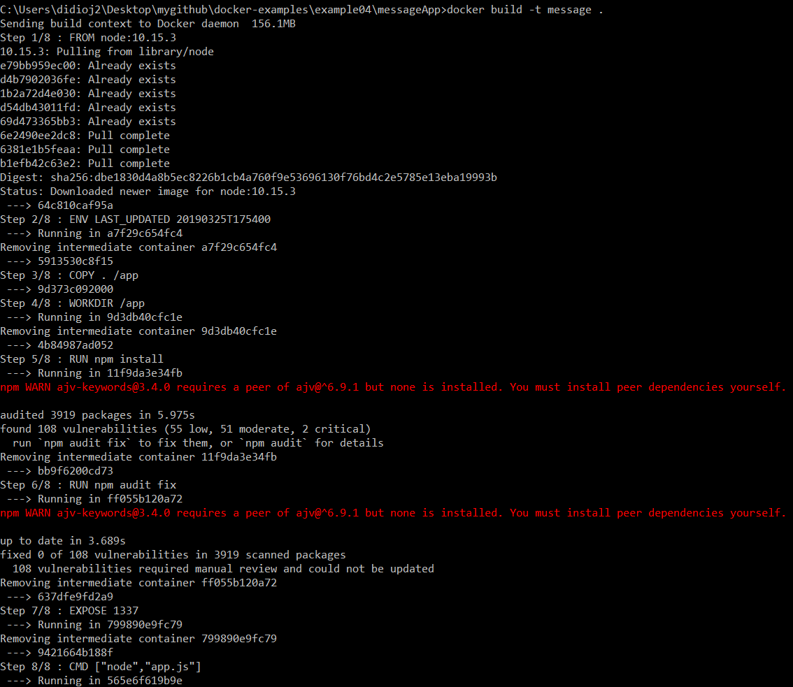
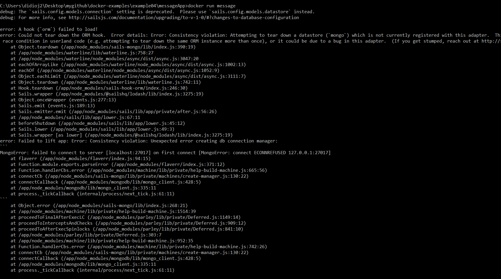

I then created a docker compose file, built it, and hosted it.

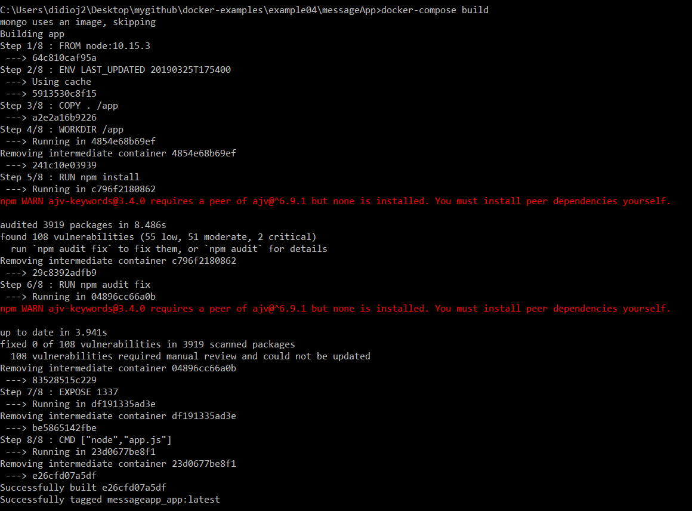
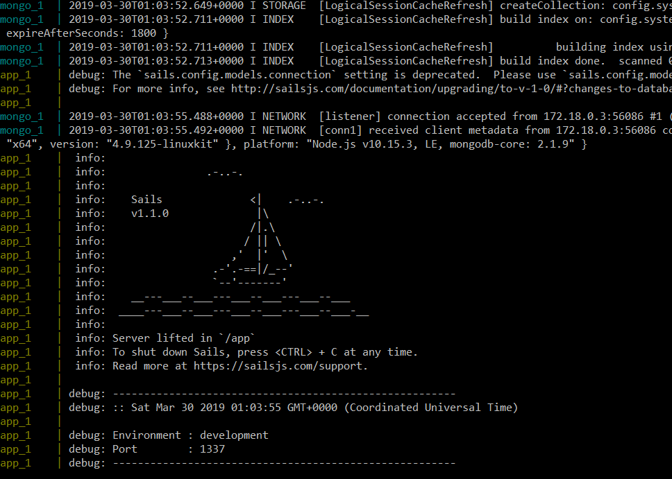

Finally, I used curl to add and modify some messages in the container.

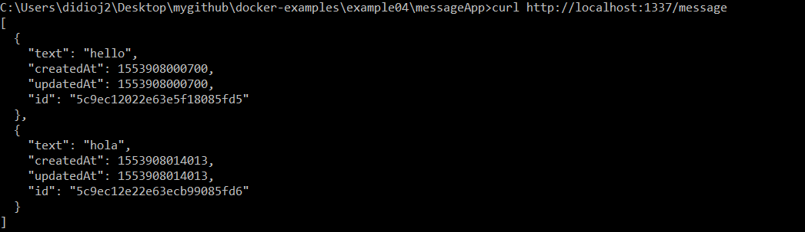
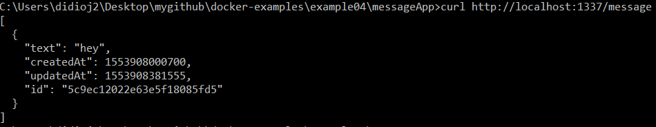