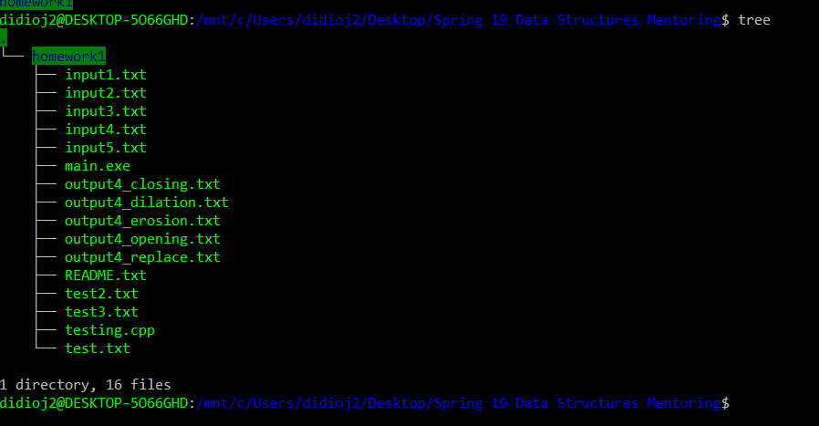
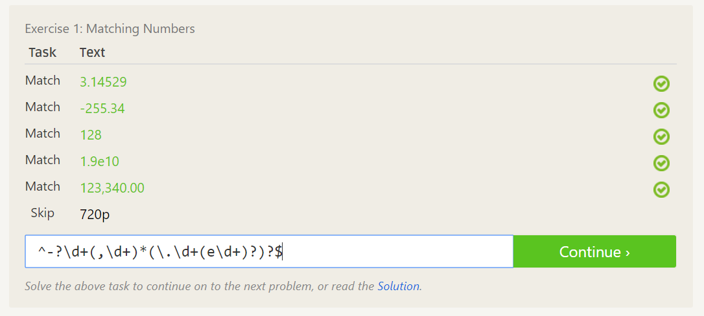
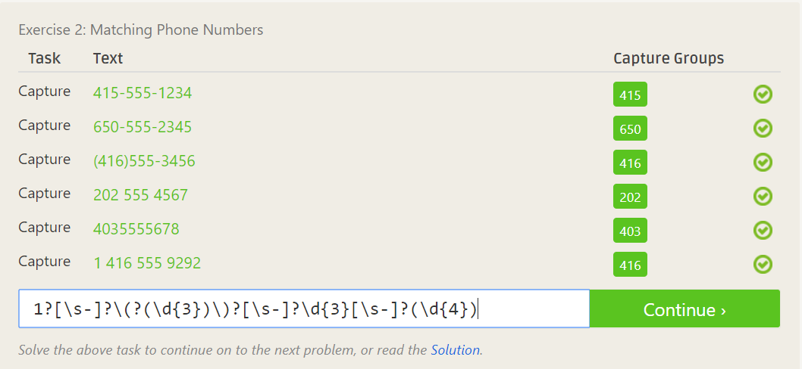
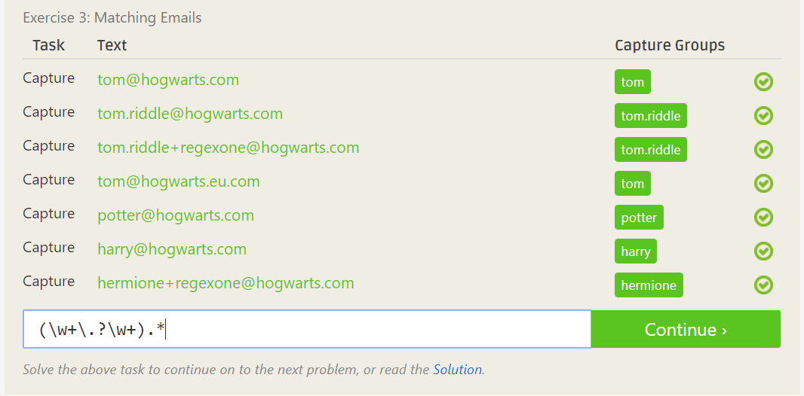
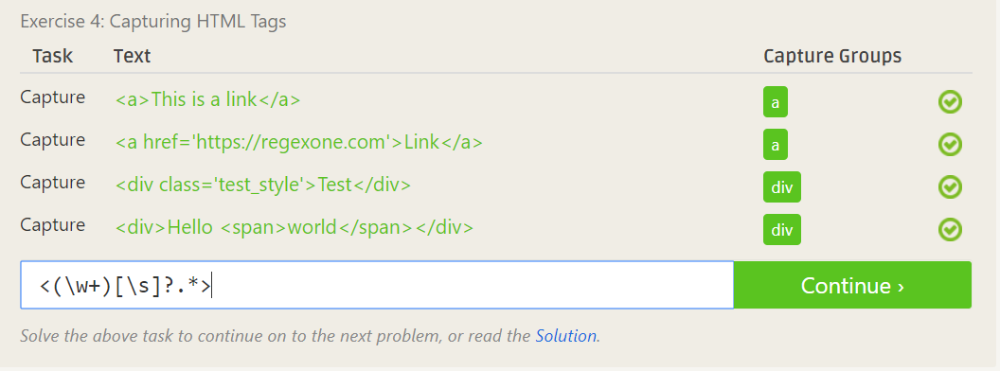
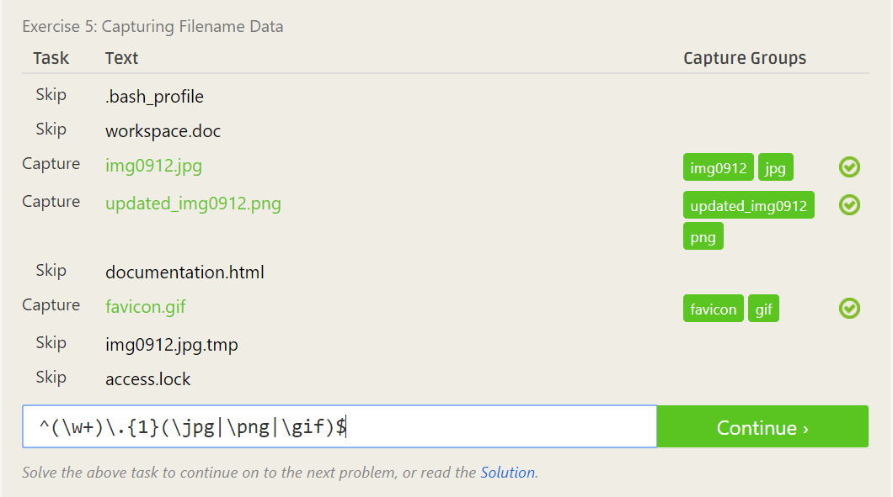
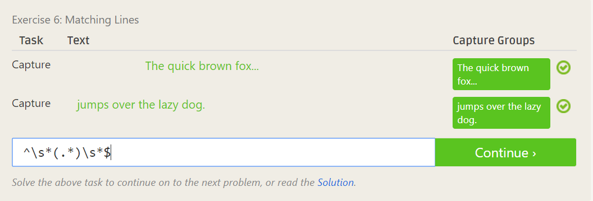
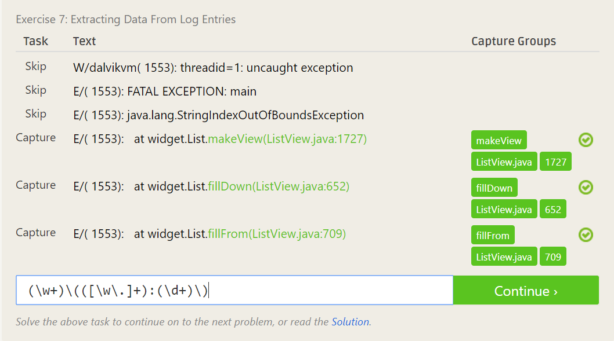

### Reading Assignment Analysis:

#### Speaking from experience as a Data Structures mentor, it is helpful to answer questions these two ways:

1. Be understanding of the other person's question, and listen to what they're really asking before answering.

2. Be concise, but don't just give them the answer. Try to direct their reasoning in such a way that they figure out the answer themselves.

#### Chapter Analysis Paragraph:

From reading that chapter, I came away with a certain sense of how important it is to promote freedom of ideas
and expression in technology. It's completely unfair that there exists a system whereby talented people like Jesse Jordan
could be punished for tinkering with technology in a completely unharmful way. Previously, I didn't understand that it was so easy
to infringe on institutions or other groups in such a harmless way that still causes such grave repercussions. As such, I feel that the
open source software movement occupies a beneficial spot in society not only for what it produces, but for the systems that it helps
defeat. Systems that suppress the exchange of ideas and pursuit of progress by many need to be gone with, and the OSS movement aims to
assist with that. And it's not only programmers that benefit as well. The author mentioned that the artists that work with the lobby
do not earn nearly as much as the lobby itself, so by working against that system, they are helping represent the rights of others as well.
And I look forward to assisting this movement, to help myself and fellow students.

### Tree Screenshot

### Regex 7 Puzzles screenshots

