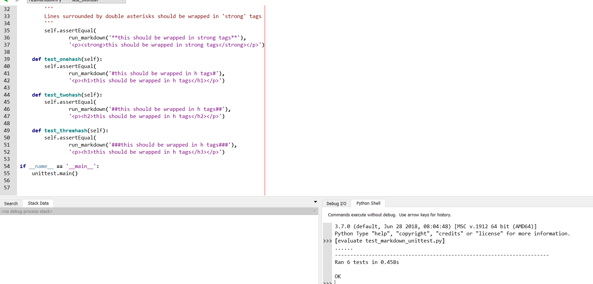

# RPEye Analysis
### By Jakob Didio

Number of Contributors: 18
Number of lines of code: 76224
First commit: 91d45a2a945f4ee225c405d334f688561973b8ad Oct. 1, 2018
Latest commit: f4d9c1db0415656d38a4dd3e39ed6b17578a5ec1 Jan. 22, 2019
Current branches: master, Crawler, Indexing, Link-Analysis, Ranking, Text-Transformation, UI-UX

### Comparison to gitstats:

Gitstats says that there are 27 contributors.
It also says that there are 203309 lines of code, where 400450 have been added and 197141 removed.
From the report, I can also see that the project has been inactive recently, but was very active
approximately 12 weeks ago.

### Images:

### Links:
