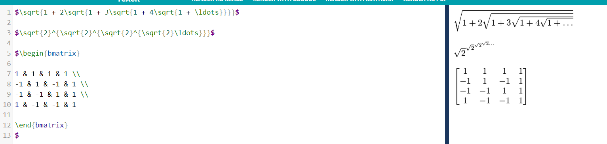

# Lab 3
### By Jakob Didio

### RPEye Analysis:

Number of Contributors: 18  
Number of lines of code: 76224  
First commit: 91d45a2a945f4ee225c405d334f688561973b8ad Oct. 1, 2018  
Latest commit: f4d9c1db0415656d38a4dd3e39ed6b17578a5ec1 Jan. 22, 2019  
Current branches: master, Crawler, Indexing, Link-Analysis, Ranking, Text-Transformation, UI-UX  

### Comparison to gitstats:

Gitstats says that there are 27 contributors.  
It also says that there are 203309 lines of code, where 400450 have been added and 197141 removed.  
From the report, I can also see that the project has been inactive recently, but was very active  
approximately 12 weeks ago.

### Images:

### Links:

Code: https://github.com/didioj/Labs/blob/master/markdown.py  
Test code:
https://github.com/didioj/Labs/blob/master/test_markdown_unittest.py  
Youtube playlist for gource for projects: 
https://www.youtube.com/playlist?list=PLqK4XFvVMI8WY_5vDILij_2Bfbp2nEowM  
There are no discernible leaders for these projects.

### Analysis of other projects

Reda

-Number of contributors: 1
-Codes: 20 lines

First commit: 21d65dd33002a0364635b792a6c9bf490a7661c3 'Initial commit'

Latest commit: 4daba655d5a2c2b88ecdbf576209b07283f0e19c 'Update LICENSE'

Current branch: master

12:49 PM  

RPICourseTrends
-Number of contributors: 5
-Codes: 162112 lines

First commit: a1e873f150f62158a074b5c784def0f87b186c9a 'Initial commit'

Latest commit: ad8be1be0f286872b6a44928bbaf6b4d536f2ec9 'Update README.md'

Current branch: master  

RPI_GroUber
-Number of contributors: 6
-Number of lines of code: 55
-First commit: 3214d376a89a3792311662c10291c9e31b197cfc (Jan 14, 2019)
-Latest commit: 5c15fa6b6593210809cca45c5d10be3e3cfdcc5a (Jan 26, 2019)
-Current branches: master, create-account, add-liscense-1  

Campus

campus map

4 contribs

22309 lines

first commit sept 28, 2018

last commit jan 25 2019

1 branch

### Other images:

